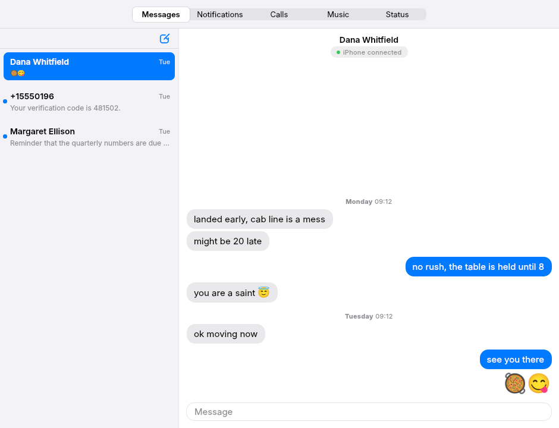

<div align="center">

# 📱🐧 iPhone Bridge

**Your iPhone's messages, calls, notifications, and contacts — on your Linux desktop, over Bluetooth.**

[](https://github.com/santisbon/iphonebridge/actions/workflows/ci.yml)
[](https://github.com/santisbon/iphonebridge/releases/latest)
[](LICENSE)
[](https://www.python.org)
[-lightgrey.svg)](#requirements)

*No Mac relay. No cloud service. No subscription. Just Bluetooth.*



</div>

---

Windows and macOS users can get their iPhone's texts and notifications on the desktop. There has never been a Linux equivalent:

- KDE Connect needs the Android/iOS *app* and on iOS it's missing notifications, SMS, and needs the iPhone app on-screen to maintain the connection. 
- `ancs4linux` does notifications only.
- Mac-relay bridges (BlueBubbles, AirMessage) need an actual Mac. 
- Beeper no longer supports iMessage.
- Microsoft's Phone Link is Windows-only.

**This is that missing piece.** It's a small Python daemon that talks to a paired iPhone over standard Bluetooth profiles (MAP, PBAP, ANCS, HFP) and surfaces everything as native desktop notifications, a CLI, and a desktop app.

## ✨ What it does

| Feature | How | Status |
|---|---|---|
| 📨 **Incoming SMS + iMessage** as desktop notifications | MAP MNS push | ✅ |
| 📤 **Send SMS + iMessage** from the CLI or app | MAP `PushMessage` | ✅ |
| 📋 **Verification codes auto-copied** to the clipboard | OTP detection | ✅ |
| 👤 **Contact-name resolution** (1000s of contacts) | PBAP → SQLite cache | ✅ |
| 🔔 **Every app's notifications** — Slack, WhatsApp, Mail… | ANCS over BLE | ✅ |
| 📞 **Take & place phone calls** — caller ID, answer/decline, dial | HFP via oFono | ✅ |
| 🔁 **Read-state sync** — read on either device, syncs to both | MAP read-state writes | ✅ |
| 📜 **Message history** — incoming + your desktop replies | `sms-list` / the app | ✅ |
| 🖥️ **Desktop app** — conversations, notification feed, call UI | Qt 6 / QML | ✅ |
| ⚙️ **Runs unattended** | systemd user service | ✅ |

## 🚧 Limitations

These are Apple's Bluetooth-stack limits, not bugs:

- No iMessage **attachments, reactions, read receipts, or typing indicators** (MAP doesn't carry them).
- No **group iMessage / MMS / RCS** — MAP is 1-to-1 only.
- **Messages composed on the iPhone itself don't sync** — iOS exposes only your *inbox* over MAP, never the sent folder. Replies you send *from* iphonebridge are recorded into conversation history; texts you type on the phone aren't visible to any Bluetooth bridge.
- HFP calls are **1-to-1 voice only** — no conference calls, no FaceTime (HFP carries neither).
- Notification *bodies* are subject to the iPhone's "Show Previews" setting.
- **Deletions don't sync, in either direction.** Deleting on the iPhone does
  not remove the message here: iOS sends no deletion event over MAP, an open
  OBEX session keeps serving the pre-delete view, and conversation history is
  an append-only log with no retraction. Deleting from Linux does not remove
  it there either: writing the per-message `Deleted` flag is accepted without
  error but ignored, and the message reappears on the next reconnect after
  BlueZ drops it from the current session's view. The `Read` flag on the same
  interface does sync both ways, so this is an iOS choice rather than a BlueZ
  limit. Measured on iOS 26.6.1; a delete on the phone also renumbers every
  remaining message handle, which is why history is deduplicated by content
  rather than by handle.

## 📋 Requirements

| | Minimum | Tested with |
|---|---|---|
| **OS** | Linux (GNOME or KDE Plasma), BlueZ 5.72+ | Pop!_OS 24.04 (GNOME) · Kubuntu 26.04 (Plasma 6) |
| **Bluetooth adapter** | Intel chipset (for ANCS) | Intel AX-series · BE200 (MAP/PBAP/HFP work; ANCS doesn't — see Troubleshooting) |
| **Python** | 3.10+ | 3.12, 3.14 |
| **iPhone** | iOS 16.5+ | iPhone 16 Pro Max, iOS 26.5 · iPhone 17 Pro, iOS 26.6.1 |
| **System packages** | `bluez`, `bluez-obexd`, `python3-dbus`, `python3-gi`, `python3-pyqt6` + its QtQuick modules (+ `ofono` for calls, `wl-clipboard` for code auto-copy) | — |

> ⚠️ **Adapter chipset matters for ANCS.** Per-app notifications need a real BLE bond with the iPhone. Intel adapters do this reliably. **Realtek adapters and every USB Bluetooth dongle tested so far do *not*** — their firmware negotiates legacy keys that block the cross-transport key derivation iOS needs. SMS/iMessage/contacts (MAP/PBAP) work on any adapter; only ANCS is picky. See [bmh129/ancs4linux's hardware notes](https://github.com/bmh129/ancs4linux).

## 🚀 Installation

Use this on any apt-based distro, e.g. **Debian, Ubuntu and its flavors (Kubuntu, Xubuntu…), Pop!_OS, Linux Mint**. Sandboxed formats (Snap/Flatpak) can't ship the daemon's privileged pieces without defeating the purpose of sandboxing.

One package installs everything: daemon, CLI, desktop app, launcher
entry, systemd unit, and the privileged sudoers rules.

Download the `.deb` from the
[latest release](https://github.com/santisbon/iphonebridge/releases/latest),
then:

```bash
sudo apt install ./iphonebridge_*_all.deb
sudo adduser $USER iphonebridge # then reboot
```

Reboot is needed because a re-login is not enough — user services keep their old groups
while any session survives the logout. Then pair your iPhone and run
`iphonebridge pair-setup`.

The full walkthrough, including the iPhone-side toggles, optional calls
and per-app notifications, building the package yourself, and a
teardown script, is in
[`packaging/deb/README.md`](packaging/deb/README.md).

## 🖥️ Desktop app

A separate process from the daemon, talking to it over D-Bus, so you can open and close it freely while the daemon keeps running in the background.
```bash
iphonebridge-ui
```

## 💻 CLI

The `iphonebridge` command does everything the app does, plus setup and diagnostics:

| Command | What it does |
|---|---|
| `iphonebridge run` | Run the daemon in the foreground (the systemd service uses this) |
| `iphonebridge doctor` | Check prerequisites — config, adapter class, obexd, state dir |
| `iphonebridge pair-setup` | First-run wizard — find the paired iPhone, write config |
| `iphonebridge sms-list` | Recent messages — `-n N`, `--from <contact>`, `--source iphone\|local` |
| `iphonebridge sms-send <to> <body>` | Send an SMS / iMessage (`<to>` = number or contact name) |
| `iphonebridge call <to>` | Place a phone call over HFP — number, contact name, or `1-800-LETTERS` |
| `iphonebridge calls` | List active calls |
| `iphonebridge hangup` | Hang up the active call(s) |
| `iphonebridge contacts-sync` | Force a contacts refresh (otherwise automatic every 24 h) |
| `iphonebridge ancs-enable` | One-time setup for per-app notifications (ANCS) |
| `iphonebridge hfp-enable` | One-time setup for phone calls (HFP) |
| `iphonebridge version` | Print the version |

```bash
# Recent messages — live from the iPhone, or from the daemon's own log
iphonebridge sms-list -n 20
iphonebridge sms-list --from Maddie
iphonebridge sms-list --source local

# Send — recipient can be a phone number OR a contact name
iphonebridge sms-send "+15551234567" "on my way"
iphonebridge sms-send Maddie "running late"

# Calls — needs HFP set up (install step 8)
iphonebridge call Maddie
iphonebridge calls
iphonebridge hangup

# Watch the daemon live · control the service
journalctl --user -u iphonebridge -f
systemctl --user {start,stop,restart} iphonebridge
```

## 🩺 Troubleshooting

<details>
<summary><b>Messages stopped arriving</b></summary>

The iPhone times out OBEX sessions, and anything that drops the pairing — a
forget + re-pair, an obexd restart — kills them outright. The daemon recovers on
its own: a 60s health check probes whether the session objects still exist, and
on finding them gone it drops to DEGRADED and reopens on the next tick of the
reopen loop. Worst case is about two minutes.

Watch it happen with `journalctl --user -u iphonebridge -f`; the line to look for
is `MAP/PBAP sessions vanished`. To skip the wait:
```bash
systemctl --user restart iphonebridge
```
What the daemon can't do for you is re-enable the step 6 toggles, which a
forget + re-pair switches off. Do that on the iPhone or it reopens straight back
into `Forbidden`.
</details>

<details>
<summary><b><code>Forbidden</code> errors in the log</b></summary>

An iPhone toggle is off. Check **Settings → Bluetooth → ⓘ → Show Message Notifications / Sync Contacts / Show System Notifications**.
</details>

<details>
<summary><b>Contacts stay at 0 — <code>PBAP transfer wrote no file</code></b></summary>

The first pull straight after you enable *Sync Contacts* often returns an empty
file: the daemon issues `PullAll` within a second of the PBAP session opening and
the iPhone isn't serving the phonebook yet. Restart the daemon and it re-pulls on
startup. A healthy pull logs `parsed N contacts from M bytes` and takes several
seconds for a large phonebook.

`iphonebridge contacts-sync` forces the same pull without a restart. With the
daemon running it asks it over D-Bus, so the daemon's existing MAP and PBAP
sessions are reused rather than torn down; with the daemon stopped it opens its
own sessions and closes them again.
</details>

<details>
<summary><b>ANCS notifications never arrive</b></summary>

ANCS needs a BLE bond, which needs a fresh pair done with the adapter correctly set up. Run `iphonebridge ancs-enable`, then forget + re-pair the iPhone, then restart the daemon.

Side effect to know about: the connection cycling this involves can crash bystander BlueZ user daemons — `mpris-proxy` (media keys for Bluetooth audio) has segfaulted on it, and `ofonod` has aborted on modem power-up. Neither affects messages or contacts; `systemctl --user restart mpris-proxy` / `sudo systemctl restart ofono` bring them back.

Check whether the bond actually formed — if ANCS worked, the iPhone's device object carries the ANCS GATT service UUID:

```bash
busctl --system tree org.bluez | grep dev_          # find your device path
busctl --system get-property org.bluez <path> org.bluez.Device1 UUIDs \
  | grep -i 7905f431-b5ce-4e99-a40f-4b1e122d00d0
```

No match means the bond is still BR/EDR-only, and iOS won't offer the *Show System Notifications* toggle at all. An Intel adapter is necessary but not sufficient; `spike/RESULTS.md` §5 has the BR/EDR-vs-BLE mutex this runs into. Confirm the chipset with:

```bash
lsusb | grep -i bluetooth        # Intel Corp. = supported; Realtek / dongles = not
```

**Check the advertisement registered at all.** The toggle also needs the
ANCS-soliciting BLE advertisement the daemon registers at startup
(`spike/RESULTS.md` §1). A failure is logged plainly:

```bash
journalctl --user -u iphonebridge | grep -i advert
# good: BLE advert registered: /me/santisbon/iphonebridge/ancs_advert
# bad:  RegisterAdvertisement failed: org.bluez.Error.Failed: ...
```

If it failed, first clear stale advertising slots — bluetoothd can hold
instances from earlier sessions that are never released:

```bash
# ActiveInstances = in use, SupportedInstances = still free
busctl --system get-property org.bluez /org/bluez/hci0 \
  org.bluez.LEAdvertisingManager1 ActiveInstances SupportedInstances
sudo systemctl restart bluetooth     # releases stale instances
systemctl --user restart iphonebridge
```

> Known-unresolved: on one BlueZ 5.85 / Intel BE200 setup, registration
> fails with `org.bluez.Error.Failed` even with every slot free and a bare
> `Type: peripheral` advert carrying no payload, from a separate process on
> its own object path. That points below iphonebridge, at BlueZ or the
> controller. MAP and PBAP are unaffected, so messages and contacts keep
> working; only ANCS is lost. Reports from other chipsets welcome.
</details>

<details>
<summary><b>Calls don't connect, or there's no call audio</b></summary>

If `systemctl status ofono` shows `core-dump`, the distro's ofonod crashed (seen once when the modem powered during HFP registration): `sudo systemctl restart ofono`, then restart the daemon.

HFP needs oFono, and oFono must start *after* WirePlumber so it can claim the HFP profile. Run `iphonebridge hfp-enable`, then `sudo systemctl restart ofono`, reconnect the iPhone, and restart the daemon. If `journalctl -u ofono` shows `RegisterProfile … UUID already registered`, the start order is wrong — restart oFono again after WirePlumber is up.
</details>

<details>
<summary><b>App won't open — no window, no error</b></summary>

The window is QML, loaded at startup from the installed package. If the
QtQuick runtime modules are missing the process exits immediately and the
journal shows `QML failed to load from …`. The `.deb` depends on them; a
source checkout has to install them:

```bash
sudo apt install python3-pyqt6 python3-pyqt6.qtqml python3-pyqt6.qtquick \
                 python3-dbus.mainloop.pyqt6 \
                 qml6-module-qtquick-controls qml6-module-qtquick-layouts \
                 qml6-module-qtquick-templates qml6-module-qtquick-window
```

Note that the app is **not** single-instance: unlike the GTK version it
takes no D-Bus name, so running `iphonebridge-ui` twice gives you two
windows rather than raising the first one.
</details>

<details>
<summary><b>The app is light even though my desktop is dark</b></summary>

Expected, for now. The UI uses QtQuick Controls' default Basic style,
which draws a fixed light palette and follows neither the desktop theme
nor `QStyleHints.setColorScheme`. Dark mode returns when the Qt UI gets a
style of its own — the step after the port from GTK.
</details>

<details>
<summary><b><code>Unable to acquire the address of the accessibility bus</code></b></summary>

Noise, not a fault — the app works normally. `iphonebridge-ui` is a
Qt/QML process, but Qt loads a *platform theme plugin* on startup to pick
up your desktop's fonts, colours and dialogs, and on a GTK desktop that
plugin initialises GTK inside the app's process. The warning is GTK's,
about `at-spi-dbus-bus.service` being masked on your system, and the app
itself never imports GTK. Silence it either way:

```bash
GTK_A11Y=none iphonebridge-ui                       # skip a11y for this launch
systemctl --user unmask at-spi-dbus-bus.service     # or turn a11y back on
systemctl --user start at-spi-dbus-bus.service
```

The app deliberately doesn't set `GTK_A11Y=none` itself — that would
silence the accessibility bus for every GTK program the session starts
afterwards, including for people who need it.
</details>

<details>
<summary><b>Verification codes aren't being copied</b></summary>

Install a clipboard tool: `sudo apt install wl-clipboard` (Wayland) or `xclip` (X11). The daemon log shows `no clipboard tool worked` when none is present.
</details>

<details>
<summary><b><code>iphonebridge: command not found</code></b></summary>

The CLI lives in the venv. Either `source .venv/bin/activate`, or create the `~/.local/bin` symlink from install step 2.
</details>

<details>
<summary><b><code>ModuleNotFoundError: No module named 'dbus'</code></b></summary>

The venv was created by a Python that isn't the system one. Run `head -3 .venv/pyvenv.cfg`; if `command =` names anything under `~/anaconda3`, `~/miniconda3`, or `~/.pyenv`, that's it. `--system-site-packages` inherits the site-packages of whichever interpreter created the venv, so a conda or pyenv venv never sees apt's `/usr/lib/python3/dist-packages` where `python3-dbus`, `python3-gi`, and `python3-pyqt6` live. Those apt builds are also compiled against the system interpreter specifically, so a version mismatch would break them regardless.

Rebuild against the system Python:

```bash
rm -rf .venv
/usr/bin/python3 -m venv --system-site-packages .venv
.venv/bin/pip install -e .
.venv/bin/python -c "import dbus, gi; print('ok')"
```

The `~/.local/bin` symlinks point at paths inside `.venv`, so they keep working without relinking.
</details>

## 🙏 Credits

This repository is a fork of
[gabrielmeir53/iphonebridge](https://github.com/gabrielmeir53/iphonebridge),
forked at v0.4.2 and maintained independently by
[santisbon](https://github.com/santisbon).

iphonebridge stands on the shoulders of two prior projects, both GPL-2.0:

- **[bmh129/ancs4linux](https://github.com/bmh129/ancs4linux)** — an archived (2026-05-31) fork whose empirical work on BR/EDR-vs-BLE coexistence, the `LastUsedBearer=le` unlock, and adapter compatibility made iphonebridge's ANCS support possible. The ANCS wire-format code in [`src/iphonebridge/ancs/`](src/iphonebridge/ancs/) is derived from their `observer/ancs/` modules.
- **[pzmarzly/ancs4linux](https://github.com/pzmarzly/ancs4linux)** — the original 2022 reference implementation of ANCS on Linux.

## 📄 License

[GPL-2.0-or-later](LICENSE) · © 2026 Gabe Shatunovsky · fork modifications © 2026 santisbon
